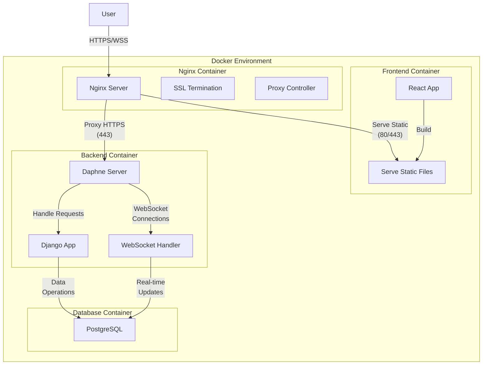
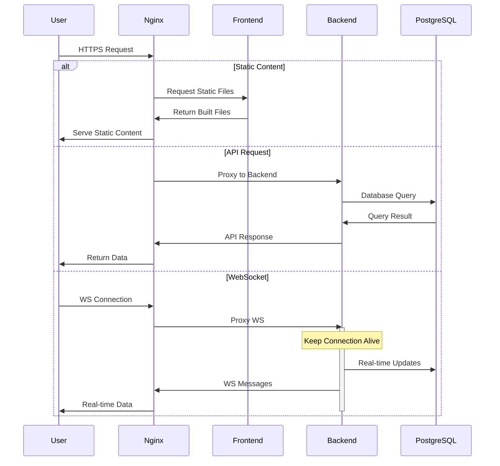
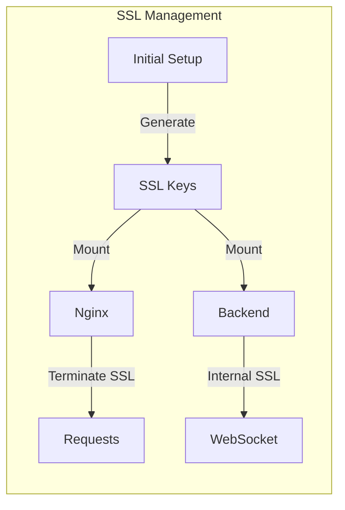
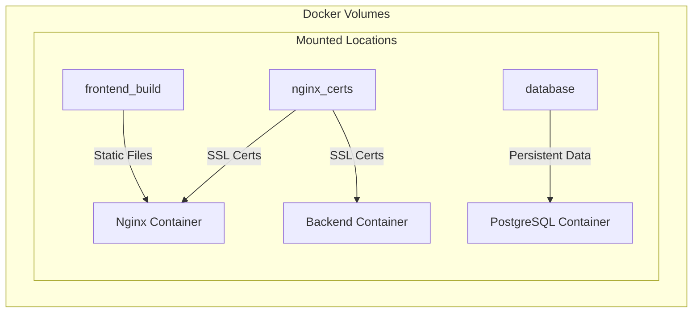
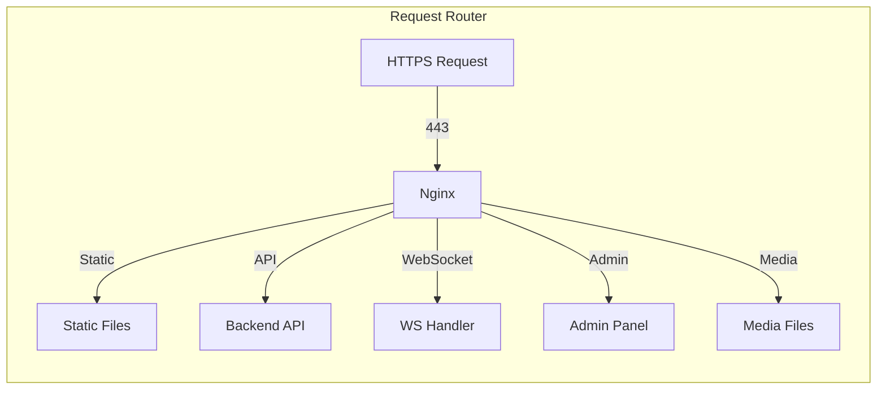

# 🏓 ft_transcendence: Real-time Multiplayer Pong

> _Experience the classic Pong game reimagined with modern web technologies and real-time multiplayer capabilities!_

## 🌟 Features

### 🎮 Game Features

- Real-time multiplayer Pong gameplay
- Matchmaking system
- Live score tracking
- Power-ups and special abilities
- Custom game rooms
- Tournament mode

### 💬 Social Features

- Real-time chat system
- Friend management
- User profiles
- Achievement system
- Global leaderboard

## 🏗️ System Architecture

### Container Architecture

### Network Flow

### SSL Certificate Management

### Volume Management

### Request Flow

## 🛠️ Technical Stack

### Frontend Container (Node.js Alpine)

- React.js with TypeScript
- CSS for styling
- Socket.io client for real-time communication
- Production-optimized build
- Static file serving
- Environment variable support

### Backend Container (Python Slim)

- Django with Daphne server
- WebSocket support
- SSL certificate integration
- Automatic migrations
- PostgreSQL integration
- Real-time game state management

### Nginx Container

- SSL termination
- Reverse proxy
- Static file serving
- WebSocket proxy
- Media file handling
- Security optimizations

### Database Container (PostgreSQL)

- Persistent storage
- Environment configuration
- Automatic restart
- Data integrity
- Backup support

## 🎨 User Interface Gallery

### Landing Page

.png>)
.png>)
.png>)
_Clean Landing Page_

### Loading Animation

_Clean Settings_

### Home Page

_Clean Home_

### Game Management

.png>)
.png>)
.png>)
.png>)
.png>)
_Clean Game Management_

### Chat Interface

.png>)
.png>)
_Clean Chat_

### Leaderboard

.png>)
_Clean leaderboard_

### Settings Panel

_Clean Settings_

### Profile Page

_Clean Profile_

## 🔒 Security Features

### SSL/TLS Configuration

- TLS 1.2 and 1.3 support
- Strong cipher suite configuration
- Automatic certificate generation
- Secure key permissions (644)

### Proxy Security

- Real IP forwarding
- XSS protection
- Secure headers
- Maximum body size limits

## 🚀 Scaling Considerations

1. **Horizontal Scaling**

   - Backend containers can be replicated
   - WebSocket connections are load-balanced
   - Static content is cached

2. **Performance Optimization**

   - Nginx caching for static files
   - Database connection pooling
   - WebSocket connection management

3. **Monitoring Points**
   - Container health checks
   - Database performance
   - WebSocket connection status
   - SSL certificate validity

## Color Palette

| Color      | Hex Code   | Usage                      |
| ---------- | ---------- | -------------------------- |
| Primary    | `#000000 ` | Main actions, buttons      |
| Secondary  | `#565656`  | Highlights, success states |
| Accent     | `#FF4242`  | Notifications, alerts      |
| Background | `#000000`  | Main background            |
| Text       | `#B0B0B0`  | Primary text               |

## 🏆 Achievement System

- 🎮 First Match
- 🏅 Tournament Victor
- 💫 Perfect Game
- 🌟 Community Legend
- 🔥 Win Streak Master

## 💡 Development Philosophy

Our project embraces:

- Clean, maintainable code
- Responsive design
- Real-time performance
- Scalable architecture
- User-centered design

## 📝 License

This project is licensed under the MIT License - see the LICENSE file for details.

---

    
Made with ❤️ by the ft_transcendence team

    
© 2025 ft_transcendence. All rights reserved.

