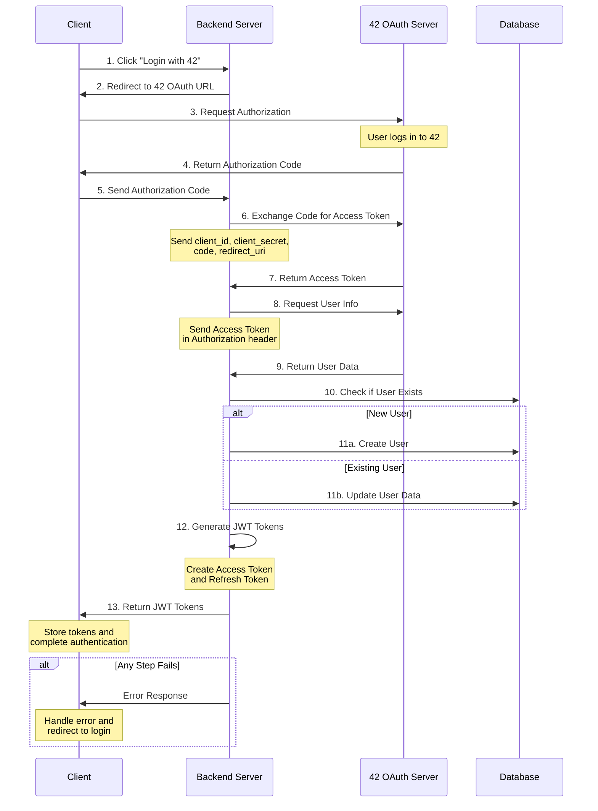

```mermaid
sequenceDiagram
    participant C as Client
    participant BE as Backend Server
    participant O42 as 42 OAuth Server
    participant DB as Database

    %% Initial OAuth Request
    C->>BE: 1. Click "Login with 42"
    BE->>C: 2. Redirect to 42 OAuth URL
    C->>O42: 3. Request Authorization
    Note over O42: User logs in to 42
    O42->>C: 4. Return Authorization Code

    %% Token Exchange
    C->>BE: 5. Send Authorization Code
    BE->>O42: 6. Exchange Code for Access Token
    Note over BE: Send client_id, client_secret,<br/>code, redirect_uri
    O42->>BE: 7. Return Access Token

    %% User Info Retrieval
    BE->>O42: 8. Request User Info
    Note over BE: Send Access Token<br/>in Authorization header
    O42->>BE: 9. Return User Data

    %% User Processing
    BE->>DB: 10. Check if User Exists
    alt New User
        BE->>DB: 11a. Create User
    else Existing User
        BE->>DB: 11b. Update User Data
    end

    %% JWT Generation
    BE->>BE: 12. Generate JWT Tokens
    Note over BE: Create Access Token<br/>and Refresh Token

    %% Final Response
    BE->>C: 13. Return JWT Tokens
    Note over C: Store tokens and<br/>complete authentication

    %% Error Handling
    alt Any Step Fails
        BE->>C: Error Response
        Note over C: Handle error and<br/>redirect to login
    end
```
