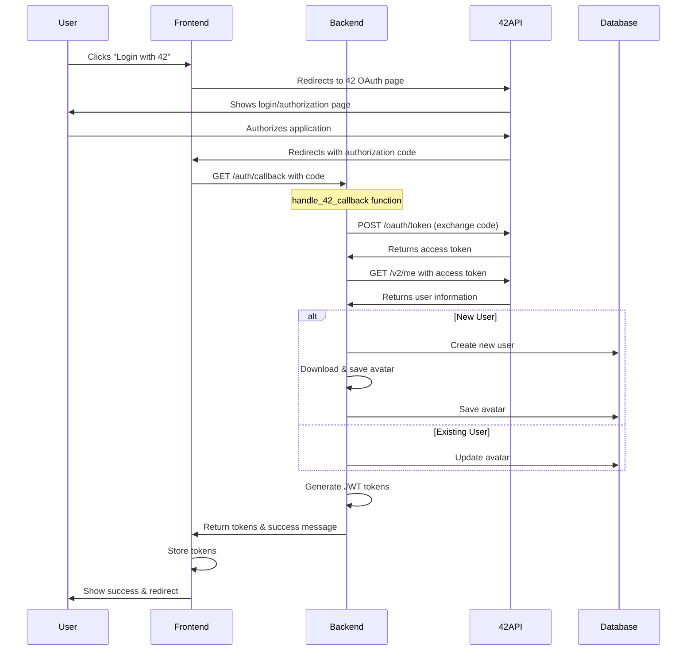

```mermaid
sequenceDiagram
    participant User
    participant Frontend
    participant Backend
    participant 42API
    participant Database

    User->>Frontend: Clicks "Login with 42"
    Frontend->>42API: Redirects to 42 OAuth page
    42API->>User: Shows login/authorization page
    User->>42API: Authorizes application
    42API->>Frontend: Redirects with authorization code
    Frontend->>Backend: GET /auth/callback with code

    Note over Backend: handle_42_callback function

    Backend->>42API: POST /oauth/token (exchange code)
    42API->>Backend: Returns access token
    Backend->>42API: GET /v2/me with access token
    42API->>Backend: Returns user information

    alt New User
        Backend->>Database: Create new user
        Backend->>Backend: Download & save avatar
        Backend->>Database: Save avatar
    else Existing User
        Backend->>Database: Update avatar
    end

    Backend->>Backend: Generate JWT tokens
    Backend->>Frontend: Return tokens & success message
    Frontend->>Frontend: Store tokens
    Frontend->>User: Show success & redirect
```
