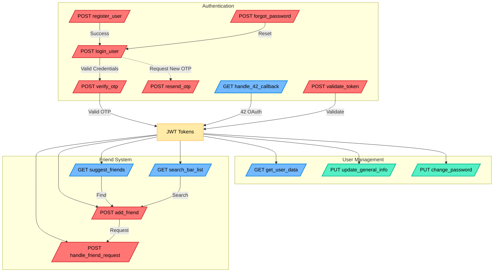

```mermaid
graph TD
    subgraph Authentication
        A1[/POST register_user/]:::post
        A2[/POST login_user/]:::post
        A3[/POST verify_otp/]:::post
        A4[/POST resend_otp/]:::post
        A5[/GET handle_42_callback/]:::get
        A6[/POST validate_token/]:::post
        A7[/POST forgot_password/]:::post
    end

    subgraph User Management
        U1[/GET get_user_data/]:::get
        U2[/PUT update_general_info/]:::put
        U3[/PUT change_password/]:::put
    end

    subgraph Friend System
        F1[/GET suggest_friends/]:::get
        F2[/POST add_friend/]:::post
        F3[/POST handle_friend_request/]:::post
        F4[/GET search_bar_list/]:::get
    end

    %% Authentication Flow
    A1 --> |Success| A2
    A2 --> |Valid Credentials| A3
    A2 -.-> |Request New OTP| A4
    A3 --> |Valid OTP| JWT[JWT Tokens]
    A5 --> |42 OAuth| JWT
    A6 --> |Validate| JWT
    A7 --> |Reset| A2

    %% Protected Routes
    JWT --> U1
    JWT --> U2
    JWT --> U3
    JWT --> F1
    JWT --> F2
    JWT --> F3
    JWT --> F4

    %% Friend System Flow
    F1 --> |Find| F2
    F2 --> |Request| F3
    F4 --> |Search| F2

    classDef post fill:#ff7675,stroke:#d63031,stroke-width:2px,color:black;
    classDef get fill:#74b9ff,stroke:#0984e3,stroke-width:2px,color:black;
    classDef put fill:#55efc4,stroke:#00b894,stroke-width:2px,color:black;
    classDef jwt fill:#ffeaa7,stroke:#fdcb6e,stroke-width:2px,color:black;

    class JWT jwt;
```
