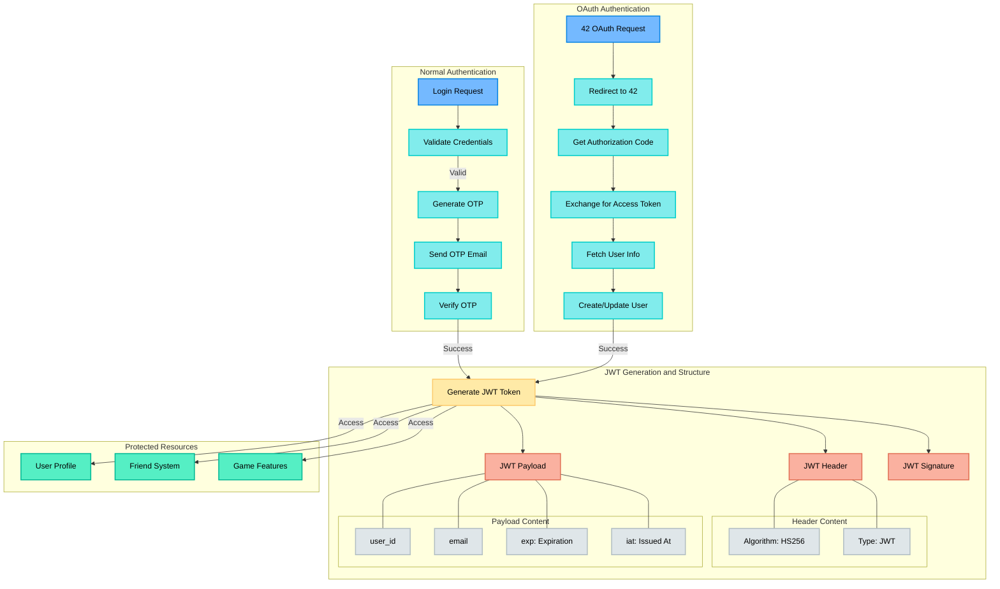

```mermaid
graph TD
    subgraph Normal Authentication
        A1[Login Request]:::request
        A2[Validate Credentials]:::process
        A3[Generate OTP]:::process
        A4[Send OTP Email]:::process
        A5[Verify OTP]:::process

        A1 --> A2
        A2 --> |Valid| A3
        A3 --> A4
        A4 --> A5
    end

    subgraph OAuth Authentication
        O1[42 OAuth Request]:::request
        O2[Redirect to 42]:::process
        O3[Get Authorization Code]:::process
        O4[Exchange for Access Token]:::process
        O5[Fetch User Info]:::process
        O6[Create/Update User]:::process

        O1 --> O2
        O2 --> O3
        O3 --> O4
        O4 --> O5
        O5 --> O6
    end

    subgraph JWT Generation and Structure
        J1[Generate JWT Token]:::jwt
        J2[JWT Header]:::jwtPart
        J3[JWT Payload]:::jwtPart
        J4[JWT Signature]:::jwtPart

        subgraph Header Content
            JH1[Algorithm: HS256]:::content
            JH2[Type: JWT]:::content
        end

        subgraph Payload Content
            JP1[user_id]:::content
            JP2[email]:::content
            JP3[exp: Expiration]:::content
            JP4[iat: Issued At]:::content
        end

        J1 --> J2
        J1 --> J3
        J1 --> J4
        J2 --- JH1
        J2 --- JH2
        J3 --- JP1
        J3 --- JP2
        J3 --- JP3
        J3 --- JP4
    end

    A5 --> |Success| J1
    O6 --> |Success| J1

    subgraph Protected Resources
        P1[User Profile]:::protected
        P2[Friend System]:::protected
        P3[Game Features]:::protected
    end

    J1 --> |Access| P1
    J1 --> |Access| P2
    J1 --> |Access| P3

    classDef request fill:#74b9ff,stroke:#0984e3,stroke-width:2px,color:black;
    classDef process fill:#81ecec,stroke:#00cec9,stroke-width:2px,color:black;
    classDef jwt fill:#ffeaa7,stroke:#fdcb6e,stroke-width:2px,color:black;
    classDef jwtPart fill:#fab1a0,stroke:#e17055,stroke-width:2px,color:black;
    classDef content fill:#dfe6e9,stroke:#b2bec3,stroke-width:2px,color:black;
    classDef protected fill:#55efc4,stroke:#00b894,stroke-width:2px,color:black;
```
