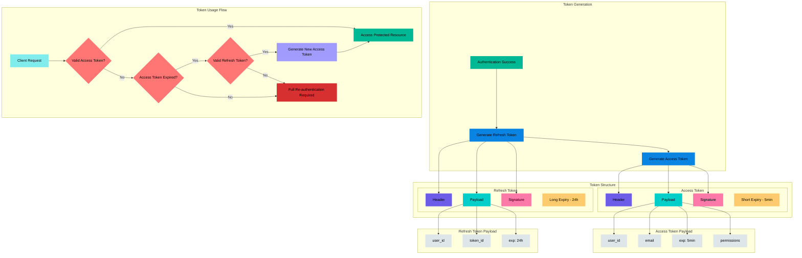

# JWT Authentication Documentation

## Overview

JSON Web Tokens (JWT) are used in our application for secure authentication and authorization. The system implements a dual-token approach with both access and refresh tokens for enhanced security.

## Token Structure

### Access Token

```javascript
{
  // Header
  header: {
    "alg": "HS256",
    "typ": "JWT"
  },

  // Payload
  payload: {
    "user_id": "123",
    "email": "user@example.com",
    "exp": 1704067200,  // 5 minutes from issue
    "iat": 1704066900,  // Issue timestamp
    "permissions": ["read", "write"]
  },

  // Signature
  signature: HMACSHA256(
    base64UrlEncode(header) + "." +
    base64UrlEncode(payload),
    secret_key
  )
}
```

### Refresh Token

```javascript
{
  // Header
  header: {
    "alg": "HS256",
    "typ": "JWT"
  },

  // Payload
  payload: {
    "user_id": "123",
    "token_id": "unique_token_identifier",
    "exp": 1704153600,  // 24 hours from issue
    "iat": 1704067200   // Issue timestamp
  },

  // Signature
  signature: HMACSHA256(
    base64UrlEncode(header) + "." +
    base64UrlEncode(payload),
    secret_key
  )
}
```

## Token Lifecycle

### Token Generation

1. After successful authentication (either through OAuth or regular login):

   ```python
   # Using Django REST framework JWT
   refresh = RefreshToken.for_user(user)
   access_token = str(refresh.access_token)
   refresh_token = str(refresh)
   ```

2. Tokens are returned to client:
   ```json
   {
     "access": "access_token_string",
     "refresh": "refresh_token_string"
   }
   ```

### Token Usage

1. Access Token:

   - Include in request header:
     ```
     Authorization: Bearer <access_token>
     ```
   - Used for all protected API endpoints
   - Short lifespan (5 minutes)

2. Refresh Token:
   - Used only to obtain new access tokens
   - Longer lifespan (24 hours)
   - Must be stored securely by client

## Authentication Flow

1. Initial Authentication:

   ```mermaid
   sequenceDiagram
       Client->>Server: Login with credentials
       Server->>Server: Validate credentials
       Server->>Client: Send access & refresh tokens
   ```

2. Protected Resource Access:

   ```mermaid
   sequenceDiagram
       Client->>Server: Request with access token
       Server->>Server: Validate token
       Server->>Client: Return protected resource
   ```

3. Token Refresh:
   ```mermaid
   sequenceDiagram
       Client->>Server: Request with expired access token
       Server->>Client: 401 Unauthorized
       Client->>Server: Request new token with refresh token
       Server->>Client: New access token
   ```

## Implementation Details

### Token Validation

```python
@api_view(["POST"])
def validate_token(request):
    auth_header = request.headers.get("Authorization")
    if auth_header and auth_header.startswith("Bearer "):
        token = auth_header.split(" ")[1]
        try:
            # Validate token
            jwt_auth = JWTAuthentication()
            validated_token = jwt_auth.get_validated_token(token)
            jwt_auth.get_user(validated_token)
            return Response({"message": "Token is valid"}, status=200)
        except TokenError:
            return Response({"message": "Invalid token"}, status=401)
```

### Protected Views

```python
@api_view(["GET"])
@permission_classes([IsAuthenticated])
def protected_view(request):
    # Access is only granted with valid token
    user = request.user
    return Response({"data": "Protected resource"})
```

## Security Considerations

1. Token Storage:

   - Access tokens: Memory only
   - Refresh tokens: Secure HTTP-only cookies

2. Token Expiration:

   - Access tokens: Short lifetime minimizes risk
   - Refresh tokens: Can be revoked if compromised

3. Token Validation:

   - Signature verification prevents tampering
   - Expiration check on every request
   - User existence verification

4. OAuth Integration:
   - Secure handling of 42 OAuth tokens
   - Proper token exchange implementation
   - User data synchronization

## Error Handling

1. Invalid Token:

   ```json
   {
     "error": "Token is invalid or expired",
     "status": 401
   }
   ```

2. Missing Token:

   ```json
   {
     "error": "Authentication credentials were not provided",
     "status": 401
   }
   ```

3. Refresh Token Failed:
   ```json
   {
     "error": "Refresh token is invalid or expired",
     "status": 401
   }
   ```

## Best Practices

1. Token Management:

   - Never store tokens in localStorage
   - Use HTTP-only cookies for refresh tokens
   - Clear tokens on logout

2. Security:

   - Implement CSRF protection
   - Use HTTPS only
   - Regular token rotation
   - Monitor for suspicious activity

3. Error Handling:
   - Proper error messages
   - Automatic token refresh
   - Graceful authentication failure

## Common Issues and Solutions

1. Token Expiration During Use:

   - Implement automatic refresh mechanisms
   - Handle refresh failures gracefully
   - Redirect to login when necessary

2. Concurrent Requests:

   - Implement token queue mechanism
   - Handle race conditions
   - Prevent multiple refresh attempts

3. OAuth Integration:
   - Handle token synchronization
   - Manage user data updates
   - Handle service unavailability
