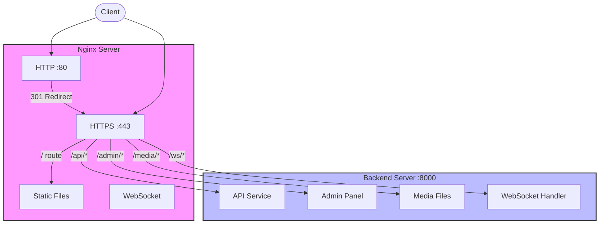
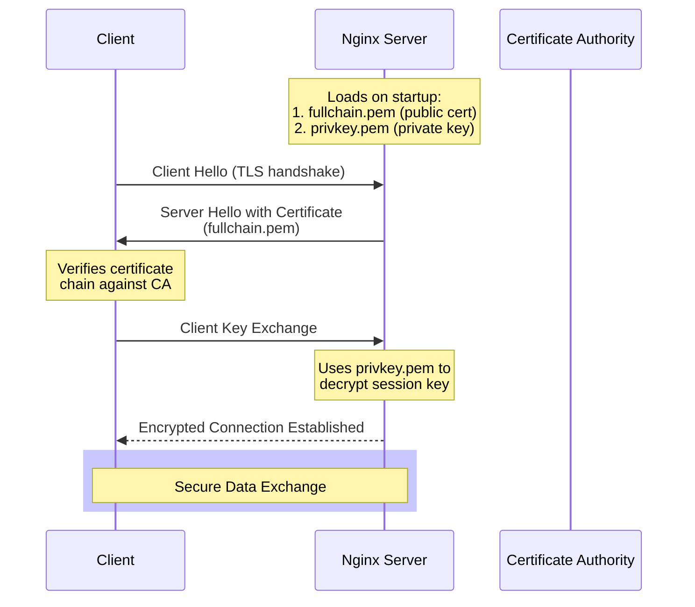

```mermaid
flowchart TD
    Client([Client])

    subgraph nginx[Nginx Server]
        http[HTTP :80]
        https[HTTPS :443]
        static[Static Files]
        ws[WebSocket]
    end

    subgraph backend[Backend Server :8000]
        api[API Service]
        admin[Admin Panel]
        media[Media Files]
        wsbackend[WebSocket Handler]
    end

    Client --> http
    http -->|301 Redirect| https
    Client --> https

    https -->|/ route| static
    https -->|/api/*| api
    https -->|/admin/*| admin
    https -->|/media/*| media
    https -->|/ws/*| wsbackend

    style nginx fill:#f9f,stroke:#333,stroke-width:2px
    style backend fill:#bbf,stroke:#333,stroke-width:2px
```

```mermaid
sequenceDiagram
    participant C as Client
    participant N as Nginx Server
    participant CA as Certificate Authority

    Note over N: Loads on startup:<br/>1. fullchain.pem (public cert)<br/>2. privkey.pem (private key)

    C->>N: Client Hello (TLS handshake)
    N->>C: Server Hello with Certificate<br/>(fullchain.pem)

    Note over C: Verifies certificate<br/>chain against CA

    C->>N: Client Key Exchange

    Note over N: Uses privkey.pem to<br/>decrypt session key

    N-->>C: Encrypted Connection Established

    rect rgb(200, 200, 255)
        Note over C,N: Secure Data Exchange
    end
```
