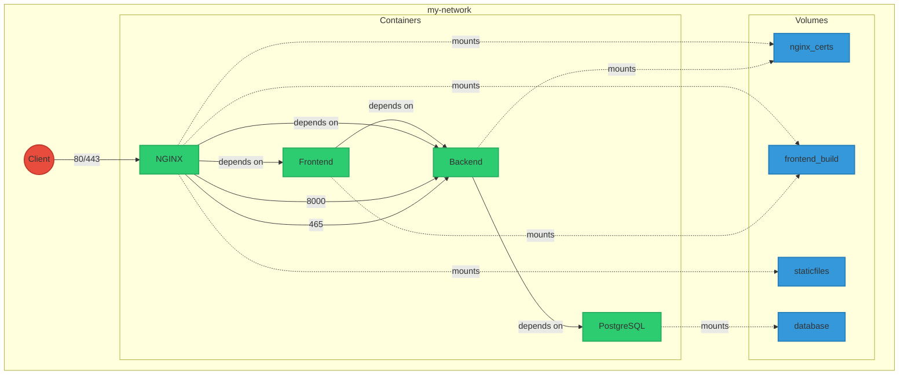

```mermaid
graph TD
    subgraph Network[my-network]
        subgraph Containers
            N[NGINX]:::container
            B[Backend]:::container
            F[Frontend]:::container
            PG[PostgreSQL]:::container
        end

        subgraph Volumes
            NC[nginx_certs]:::volume
            FB[frontend_build]:::volume
            DB[database]:::volume
            ST[staticfiles]:::volume
        end

        %% Container Dependencies
        F -->|depends on| B
        B -->|depends on| PG
        N -->|depends on| B
        N -->|depends on| F

        %% Volume Connections
        N -.->|mounts| NC
        N -.->|mounts| FB
        N -.->|mounts| ST
        B -.->|mounts| NC
        F -.->|mounts| FB
        PG -.->|mounts| DB

        %% Ports
        Client((Client)):::client
        Client -->|80/443| N
        N -->|8000| B
        N -->|465| B
    end

    classDef container fill:#2ecc71,stroke:#27ae60,stroke-width:2px;
    classDef volume fill:#3498db,stroke:#2980b9,stroke-width:2px;
    classDef client fill:#e74c3c,stroke:#c0392b,stroke-width:2px;
```
