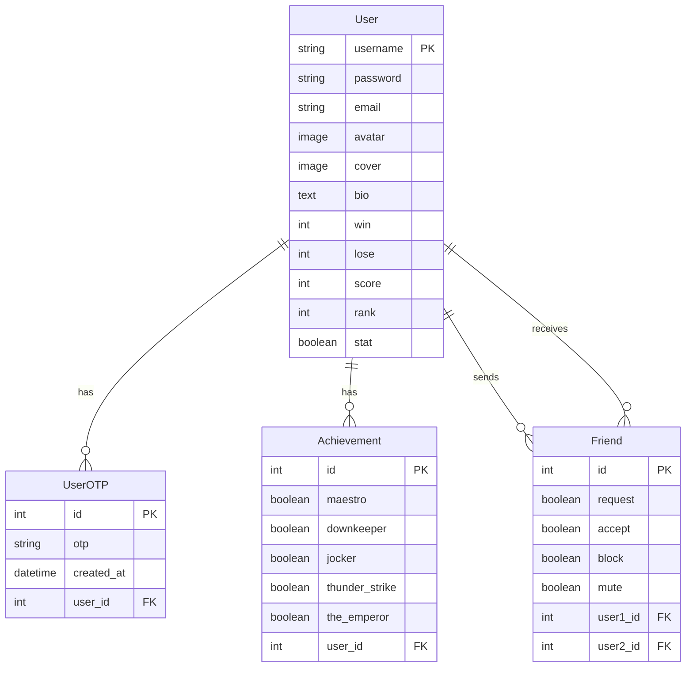

```mermaid
erDiagram
    User ||--o{ UserOTP : "has"
    User ||--o{ Achievement : "has"
    User ||--o{ Friend : "sends"
    User ||--o{ Friend : "receives"

    User {
        string username PK
        string password
        string email
        image avatar
        image cover
        text bio
        int win
        int lose
        int score
        int rank
        boolean stat
    }

    UserOTP {
        int id PK
        string otp
        datetime created_at
        int user_id FK
    }

    Achievement {
        int id PK
        boolean maestro
        boolean downkeeper
        boolean jocker
        boolean thunder_strike
        boolean the_emperor
        int user_id FK
    }

    Friend {
        int id PK
        boolean request
        boolean accept
        boolean block
        boolean mute
        int user1_id FK
        int user2_id FK
    }
```
