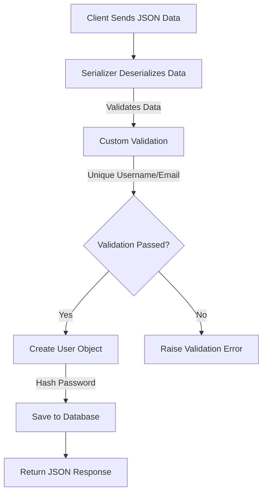

# UserSerializer Documentation

The `UserSerializer` is a Django REST Framework (DRF) serializer that handles serialization and deserialization of the `User` model. It includes custom validation, secure password handling, and enhancements for working with user data in APIs.

---

## Overview of `UserSerializer`

### **Key Features**:

- Secure password hashing before saving.
- Default handling for missing `avatar` and `cover` fields.
- Custom validation for unique usernames and emails.
- Generates absolute URLs for media fields (`avatar` and `cover`).

```python
class UserSerializer(serializers.ModelSerializer):
    password = serializers.CharField(write_only=True)

    class Meta:
        model = User
        fields = [
            "id",
            "username",
            "email",
            "password",
            "avatar",
            "cover",
            "bio",
            "win",
            "lose",
            "score",
            "rank",
            "stat",
        ]

    def create(self, validated_data):
        validated_data["password"] = make_password(validated_data["password"])
        if "avatar" not in validated_data:
            validated_data["avatar"] = "avatars/default_avatar.png"
        if "cover" not in validated_data:
            validated_data["cover"] = "covers/default_cover.png"
        return super().create(validated_data)

    def validate(self, data):
        if User.objects.filter(username=data.get("username")).exists():
            raise serializers.ValidationError(
                {"username": "This username is already in use."}
            )
        if User.objects.filter(email=data.get("email")).exists():
            raise serializers.ValidationError(
                {"email": "This email is already in use."}
            )
        return data

    def get_avatar(self, obj):
        request = self.context.get("request")
        if obj.avatar:
            return request.build_absolute_uri(obj.avatar.url)
        return None

    def get_cover(self, obj):
        request = self.context.get("request")
        if obj.cover:
            return request.build_absolute_uri(obj.cover.url)
        return None
```

---

## **Meta Class**

The `Meta` class provides metadata about the serializer:

| Attribute | Value          | Description                                         |
| --------- | -------------- | --------------------------------------------------- |
| `model`   | `User`         | Specifies the model the serializer works with.      |
| `fields`  | List of fields | Defines the fields to serialize or accept as input. |

---

## **Methods**

### **`create` Method**

- **Purpose**: Customizes how a `User` instance is created.
- **Logic**:
  1. Hashes the password for security.
  2. Sets default images for `avatar` and `cover` if not provided.
  3. Calls the parent class's `create` method to save the object.

### **`validate` Method**

- **Purpose**: Ensures the provided data adheres to business rules.
- **Key Validations**:
  1. `username`: Must be unique.
  2. `email`: Must be unique.

### **`get_avatar` and `get_cover` Methods**

- **Purpose**: Generate absolute URLs for media fields.
- **Logic**:
  - Use the `request` context to build a full URL.
  - Return `None` if no image is associated.

---

## **Data Flow Diagram**



---

## **Example Workflow**

1. **Input Data**:

   ```json
   {
     "username": "john_doe",
     "email": "john@example.com",
     "password": "12345"
   }
   ```

2. **Deserialization**:

   - Converts JSON into Python data.

3. **Validation**:

   - Ensures `username` and `email` are unique.
   - Hashes the password.

4. **Object Creation**:

   - Creates a `User` instance with defaults if needed.

5. **Response**:
   ```json
   {
       "id": 1,
       "username": "john_doe",
       "email": "john@example.com",
       "avatar": "http://example.com/media/avatars/default_avatar.png",
       ...
   }
   ```

---

## **Why Use Serializers?**

1. **Bridge Between Models and APIs**:

   - Converts complex model instances into JSON.
   - Parses JSON into Python objects for database operations.

2. **Validation**:

   - Ensures incoming data is correct and consistent.

3. **Custom Logic**:

   - Adds tailored behavior during serialization/deserialization.

4. **Security**:
   - Hashes sensitive data like passwords before saving.

---

### **References**

- [Django REST Framework Documentation](https://www.django-rest-framework.org/)
